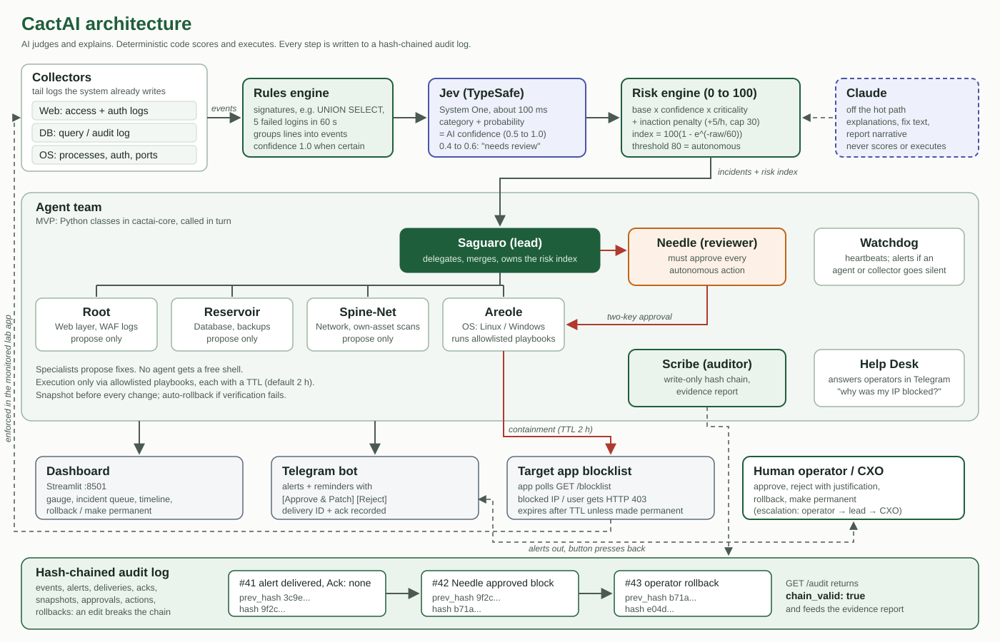

# 🛡️ SentrAI

**An accountability-based security system for organizations that can't afford a security team.**

> *"A sentry doesn't chase you. It just guards the gate."*

Small organizations already get security alerts. Breaches happen because nobody acts on them in time, and afterwards nobody can prove who knew what and when. SentrAI watches the web, database and OS layers, turns every anomaly into a live **0 to 100 risk index**, and when the organization's own risk tolerance is crossed it applies a **temporary, reversible fix** and produces a tamper-evident **evidence report** for leadership.

## Highlights

- **CIA + NA:** Confidentiality, Integrity, Availability, plus Non-repudiation and Authentication.
- **0 to 100 risk index** with an inaction penalty, so ignored alerts get louder over time.
- **AI categorization** with Jev (TypeSafe System One): typed answers and confidence in about 100 ms.
- **TTL hotpatches:** every automatic fix expires unless a human makes it permanent.
- **Hash-chained audit log** and security evidence report (Markdown, JSON, PDF).
- **Never hacks back:** it holds the line and never crosses it.

## Documentation

📄 **[Full project plan](https://rexguard.github.io/cactai/Cybersecurity%20+%20AI.html)**: problem, data collection per layer, risk formula, Jev pipeline, hotpatch workflow, notifications, accountability reports, ethics, agent design, stack, I/O schemas and MVP demo script. ([Markdown source](https://github.com/RexGuard/cactai/blob/main/Cybersecurity%20%2B%20AI.md))

## Working prototype

The MVP runs on one Windows laptop: a fictional student portal gets attacked, SentrAI scores the risk, alerts the operator, auto-blocks the attackers when the risk crosses 80, and writes a hash-chained evidence report.

- 🛠️ **[MVP code and how to run it](https://github.com/RexGuard/cactai/tree/main/mvp)**: `run_demo.ps1` starts everything; 74 automated tests including an end-to-end run of the demo story.
- 🎬 **[Video script](https://github.com/RexGuard/cactai/blob/main/mvp/pitch/VIDEO_SCRIPT.md)**, [slide outline](https://github.com/RexGuard/cactai/blob/main/mvp/pitch/SLIDES.md), [judge Q&A](https://github.com/RexGuard/cactai/blob/main/mvp/pitch/QA_PREP.md) and [sources](https://github.com/RexGuard/cactai/blob/main/mvp/research/SOURCES.md).

- 🗺️ **[Roadmap](https://rexguard.github.io/cactai/ROADMAP.html)**: 9 phases from the MVP to a pilot, with effort, owners and done-when checks.

## Team

| Member | Role |
| --- | --- |
| Erick Sientaro | Developer |
| Ishmail | CEO |
| Hozen | Notetaker |

## Status

Plan finalized. MVP working and tested. Presentation video due 29 Sep 2026.
